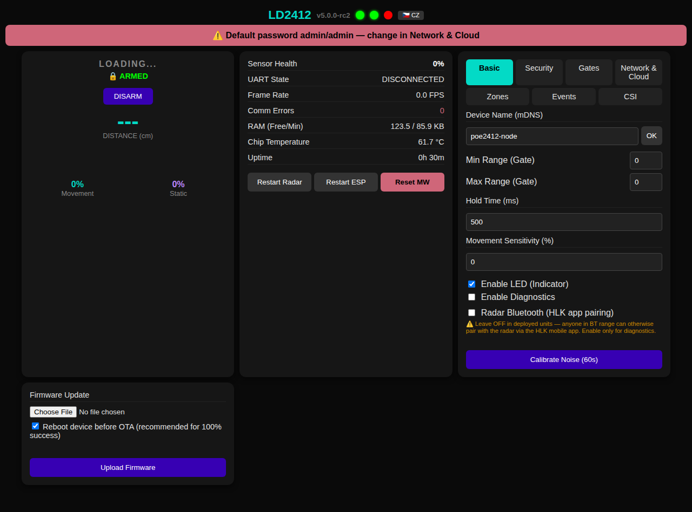
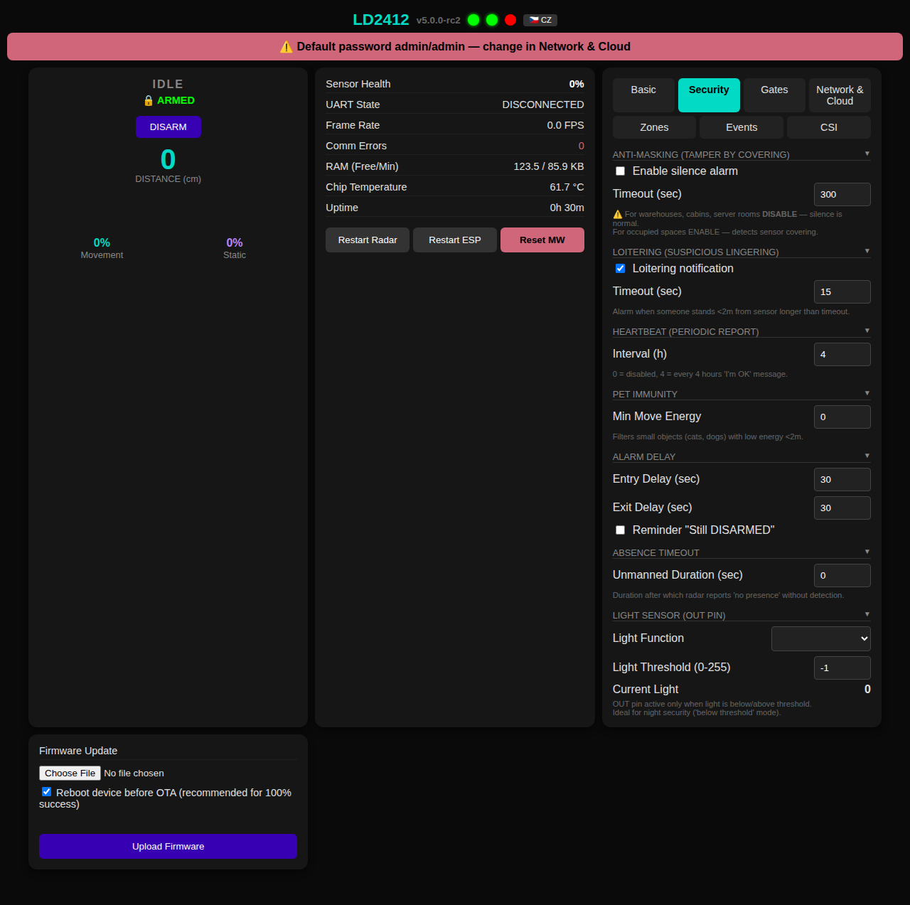
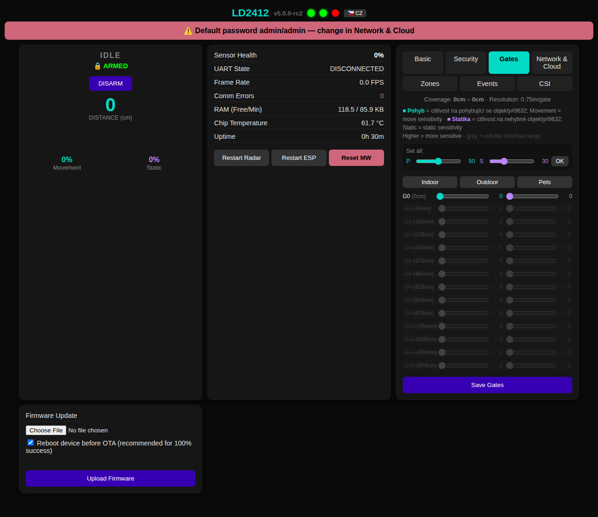
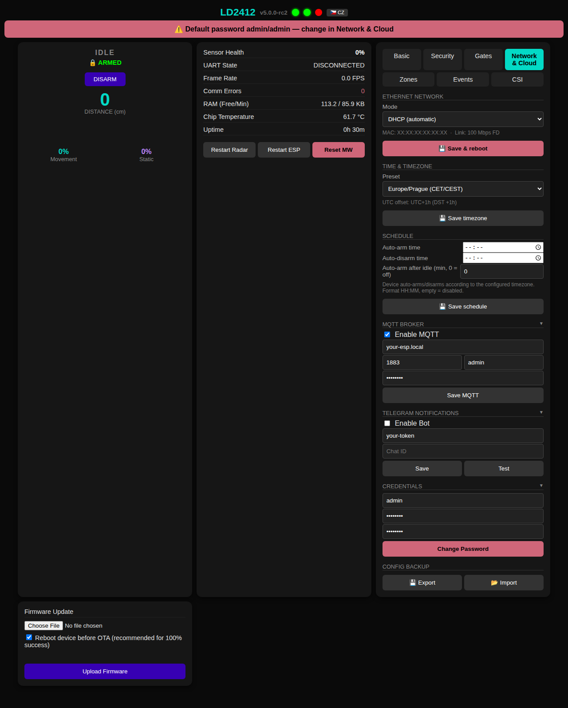
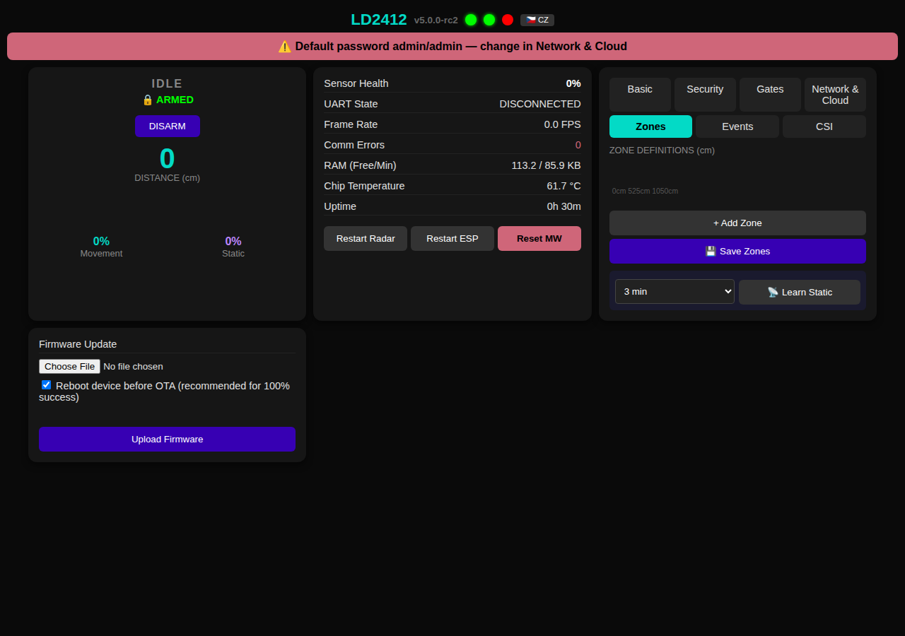
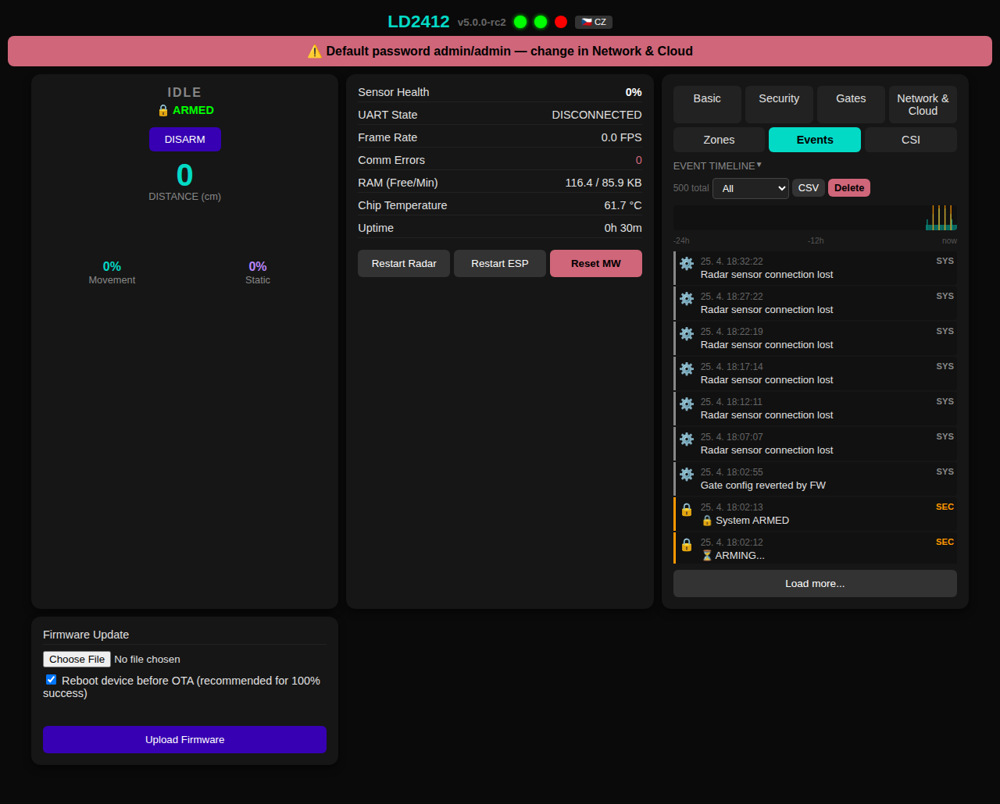
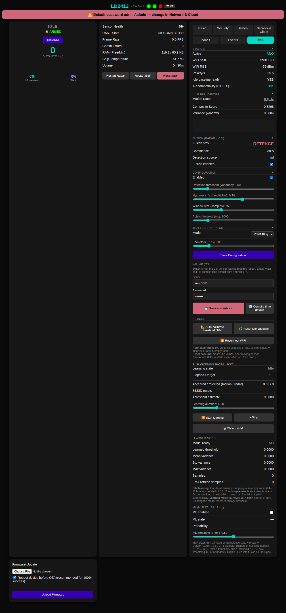

# :shield: POE-2412-WiFi-CSI Security :satellite:

[](https://platformio.org/)
[](https://www.espressif.com/)
[](LICENSE)
[]()

**Dual-sensor intrusion detection system** — ESP32 + HLK-LD2412 24 GHz mmWave radar + **WiFi CSI (Channel State Information) passive motion detection** over **wired Ethernet with Power over Ethernet**. Full alarm state machine, zone management, Home Assistant integration, Telegram bot, and a dark-mode web dashboard. No cloud required.

WiFi CSI detection algorithms based on [ESPectre](https://github.com/francescopace/espectre) by Francesco Pace (GPLv3).

> [!TIP]
> **v5.0.0** — Major release: WiFi CSI presence detection (variance / turbulence / DSER / PLCR), site learning with NVS persistence, MLP classifier (F1=0.852), 3-way radar+CSI+ML fusion, NBVI subcarrier auto-selection, adaptive P95 threshold. Pull-based OTA, cold-reboot-before-OTA flow, Network/Schedule/Timezone tabs, config export/import. All JSON HTTP responses streamed to fix endpoint failure under sustained polling on weak-RSSI deployments. See [CHANGELOG.md](CHANGELOG.md#500-poe-wifi---2026-04-25) for the full feature list.

---

## Table of Contents

- [In 3 Points](#in-3-points)
- [Why Dual Sensor?](#why-dual-sensor)
- [Who Is This For](#who-is-this-for)
- [What You Need](#what-you-need)
- [Quick Start](#quick-start) (~10 min)
- [How It Works](#how-it-works)
- [Features](#features)
- [System Architecture](#system-architecture)
- [Web Dashboard](#web-dashboard)
- [Telegram Bot](#telegram-bot)
- [API Reference](#api-reference)
- [Differences from WiFi / POE Variants](#differences-from-wifi--poe-variants)
- [Sensor Firmware Quirks](#sensor-firmware-quirks)
- [Known Issues & Limitations](#known-issues--limitations)
- [Troubleshooting](#troubleshooting)
- [Roadmap](#roadmap)
- [FAQ](#faq)
- [Development History](#development-history)
- [Acknowledgments](#acknowledgments)
- [Contributing](#contributing)
- [License](#license)

---

## In 3 Points

1. **It's a security system with dual-sensor fusion, not a smart home gadget.** mmWave radar for active detection, WiFi CSI for passive environmental sensing. Two independent physics principles — harder to defeat than either alone.
2. **It runs over Ethernet.** WiFi is used purely as a CSI sensor (passive signal analysis). Network connectivity, MQTT, OTA — all wired via PoE. No wireless attack surface on the network path.
3. **It's battle-tested.** Forked from the WiFi variant (50+ versions, 13 security bugs found and fixed through formal audit). CSI algorithms ported from ESPectre with production-grade filtering.

---

## Why Dual Sensor?

| | Radar Only | CSI Only | **Radar + CSI (this project)** |
|---|---|---|---|
| **Moving person** | Excellent | Good | Excellent (confirmed by both) |
| **Stationary person** | Weak (static energy decays) | Moderate (breathing detection) | **Strong (CSI compensates radar blind spot)** |
| **Through-wall** | Yes (24 GHz penetrates thin walls) | Yes (WiFi penetrates walls) | Yes |
| **Tamper resistance** | Radar can be shielded | WiFi can be jammed | **Harder — need to defeat both** |
| **False positives** | HVAC, curtains, reflections | AGC fluctuations, traffic | **Lower — cross-validation** |
| **Power** | ~80 mA | ~20 mA (WiFi STA) | ~100 mA total (PoE powered) |

---

## Who Is This For

- **DIY security enthusiasts** who want dual-sensor detection without cloud subscriptions
- **Home Assistant users** looking for a hardwired radar + CSI node with proper alarm state management
- **Vacation home / garage / warehouse owners** who need unattended PoE-powered monitoring
- **CSI researchers** who want a production-ready WiFi CSI implementation on ESP32 with real-world filtering
- **PoE infrastructure users** who already have a PoE switch and want to add security nodes with zero extra wiring

---

## What You Need

### Hardware

| Part | Description | ~Cost |
|------|-------------|-------|
| Prokyber ESP32-STICK-PoE-P | ESP32 + LAN8720A RMII Ethernet, active PoE | ~$15--25 |
| HLK-LD2412 | 24 GHz FMCW mmWave radar (UART) | $4--6 |
| PoE switch or injector | 802.3af/at compliant | $15--30 (or existing) |
| Ethernet cable | Cat5e or better | $1--5 |
| WiFi access point | 2.4 GHz **802.11n** AP in range (for CSI capture — **see [AP requirements](#wifi-access-point-requirements-for-csi) below**) | Existing |
| **Total** | | **~$35--65** |

> Any ESP32 board with LAN8720A RMII Ethernet should work with pin adjustments in `platformio.ini`. The Prokyber ESP32-STICK-PoE-P is the tested reference board.

### Software (All Free)

- [PlatformIO](https://platformio.org/) (VS Code extension or CLI)
- [Home Assistant](https://www.home-assistant.io/) (optional, for MQTT integration)
- [Telegram](https://telegram.org/) (optional, for mobile alerts)

### Required Skills

- Basic soldering (4 wires: VCC, GND, TX, RX from ESP32 to radar)
- Editing a config file (MQTT server, WiFi credentials for CSI)
- Flashing an ESP32 via USB (first time only — OTA after that)

### WiFi Access Point Requirements for CSI

The ESP32 WiFi radio is 802.11b/g/n only. The CSI driver extracts channel state from **802.11n HT LTF** training symbols — the ESP32 cannot decode pure HE (802.11ax) LTF. In practice this is not a limitation: WiFi 6 APs in 2.4 GHz mixed mode still transmit HT LTF preambles for backward compatibility with legacy clients, and the CSI pipeline picks those up regardless of whether the AP also emits HE traffic.

**What this means in practice**

- Most commodity 2.4 GHz APs work out of the box, including WiFi 5 / WiFi 6 consumer routers in default mixed-mode config — no dedicated legacy AP needed.
- The only APs that fail outright are those that emit *no* 802.11n traffic at all on 2.4 GHz (HE-only, greenfield WiFi 6, or exotic proprietary modes). These are extremely rare on consumer hardware.

**Built-in compatibility probe**

The `/api/csi` endpoint exposes a boolean field `ht_ltf_seen`. It flips to `true` on the first valid HT20 frame received after associating to the AP. The web UI surfaces this in the CSI tab as an **AP compatibility** row (OK / waiting / incompatible).

- `ht_ltf_seen = true` → AP is compatible, CSI pipeline is receiving frames.
- `ht_ltf_seen = false` for more than ~30 s with healthy RSSI → AP is not emitting parseable HT LTF; try another AP or a legacy-compat mode.

**If `ht_ltf_seen = true` but `packets_received` / `pps` stays near zero**, the AP is parseable but data-frame traffic is not reaching the ESP. Most common causes, all AP-side:

- **AP Isolation / Client Isolation enabled** — blocks WiFi-to-WiFi traffic; the ESP only sees beacons, not peer data frames. Typical default on TP-Link Archer, ASUS RT, and similar consumer routers. Disable in the AP's wireless security settings.
- **Smart Connect / band steering** — pushes all other clients to 5 GHz, leaving the ESP alone on 2.4 GHz with no traffic to observe. Disable band steering or expose a dedicated 2.4 GHz-only SSID.
- **No other clients on 2.4 GHz** — bench-test scenario. Enable the built-in traffic generator (`/api/config traffic_gen=true traffic_pps=100`) or join a second client.

**Diagnosing `packets=0` — quick recipe**

1. Check `ht_ltf_seen` in `/api/csi`. True = carry on to step 3; false = AP problem, try another.
2. If stuck at false, try a 5-minute test against a known-good pre-WiFi 6 router (any TP-Link / ASUS / Netgear n-class) to confirm the ESP hardware is fine.
3. If true but `pps ≈ 0`, check AP Isolation and Smart Connect settings; enable the traffic generator as a cross-check.

### WiFi 6 APs — validated working

The CSI HW filter in this firmware is restricted to HT-LTF only (matching the reference config used by the ESPectre sister project). Earlier experimental builds enabled `lltf_en`, `stbc_htltf2_en`, and `ltf_merge_en` simultaneously, which caused the hardware callback to fire on legacy (L-LTF) preambles emitted by WiFi 6 APs in backward-compat mode — those L-LTF entries arrived at a non-HT20 length and were silently dropped by the length guard, so `packets` stayed at zero even with a perfectly valid HT-LTF stream on air.

Validated on MikroTik hAP ax lite (`wifi-qcom` package, WiFi 6 silicon) at 40-60 pps and RSSI −70 dBm — an AP previously believed to be "chipset-incompatible" and now fully functional without any AP-side changes.

---

## Quick Start

**~10 minutes from clone to working alarm.**

```bash
# 1. Clone
git clone https://github.com/PeterkoCZ91/HLK-LD2412-POE-WiFi-CSI-security.git
cd HLK-LD2412-POE-WiFi-CSI-security

# 2. Create your config files (BOTH are required — build fails without them)
cp include/secrets.h.example include/secrets.h
cp include/known_devices.h.example include/known_devices.h

# 3. Edit secrets.h — set MQTT broker and WiFi credentials for CSI
#    (see "What goes in secrets.h" table below)

# 4. Wire the radar (see pin table below) and connect ESP32 via USB

# 5. Build and flash
pio run -e esp32_poe_csi --target upload    # With WiFi CSI
# or
pio run -e esp32_poe --target upload        # Radar only (no CSI)
```

### What Goes in `secrets.h`

These are compile-time defaults baked into the firmware on the **first** flash. Most of them can be changed later from the web GUI (Network & Cloud tab) without rebuilding — `secrets.h` only sets the *initial* values used until you save something through the GUI.

| Field                       | Required?         | What it does                                                                 | Editable later via GUI? |
|-----------------------------|-------------------|------------------------------------------------------------------------------|-------------------------|
| `CSI_WIFI_SSID`             | **Yes** (CSI build) | 2.4 GHz AP the ESP joins for CSI capture                                    | Yes (CSI tab → "WiFi") |
| `CSI_WIFI_PASS`             | **Yes** (CSI build) | WPA2 password for the AP above                                              | Yes (CSI tab → "WiFi") |
| `MQTT_SERVER_DEFAULT`       | Optional          | Broker IP/hostname; empty disables MQTT                                     | Yes |
| `MQTT_PORT_DEFAULT`         | Optional          | Default 1883 (8883 for TLS)                                                 | Yes |
| `MQTT_USER_DEFAULT`         | Optional          | Broker username                                                              | Yes |
| `MQTT_PASS_DEFAULT`         | Optional          | Broker password                                                              | Yes |
| `MQTTS_ENABLED`             | Optional          | `1` enables TLS to broker (also set `MQTTS_PORT` and `mqtt_server_ca`)      | No — compile-time |
| `mqtt_server_ca`            | Optional          | PEM CA cert for TLS broker (`nullptr` to skip cert verify)                  | No — compile-time |
| `MQTTS_PORT`                | Optional          | Default 8883 — only used when `MQTTS_ENABLED=1`                             | No — compile-time |
| `WEB_ADMIN_USER_DEFAULT`    | Recommended       | Initial GUI / API username (default `admin`)                                | Yes (Network tab → "Web Admin") |
| `WEB_ADMIN_PASS_DEFAULT`    | **Strongly recommended** | Initial GUI / API password (default `admin` — change before exposing) | Yes (Network tab → "Web Admin") |
| `TELEGRAM_TOKEN_DEFAULT`    | Optional          | BotFather token; empty disables Telegram                                    | Yes |
| `TELEGRAM_CHAT_ID_DEFAULT`  | Optional          | Numeric chat ID where the bot responds                                      | Yes |

> **Forgot the admin password?** Hold `GPIO 0` (BOOT button) for ≥ 5 s — factory-reset wipes NVS credentials and restores the `WEB_ADMIN_*_DEFAULT` from flash.

### Radar Wiring (HLK-LD2412 ↔ ESP32)

| LD2412 pin | ESP32 GPIO       | Direction               | Notes                                     |
|------------|------------------|-------------------------|-------------------------------------------|
| `VCC`      | `5V` (or `3V3`)  | Power                   | Module accepts 4.5–6 V; 3.3 V also works  |
| `GND`      | `GND`            | Ground                  | Common ground required                    |
| `TX`       | `GPIO33` (RX)    | LD2412 → ESP32 (UART)   | `RADAR_RX_PIN` in `platformio.ini`        |
| `RX`       | `GPIO32` (TX)    | ESP32 → LD2412 (UART)   | `RADAR_TX_PIN` in `platformio.ini`        |
| `OUT`      | `GPIO4` (opt.)   | LD2412 → ESP32 (digital)| Optional presence pin; `RADAR_OUT_PIN`    |

> Crossover: radar `TX` goes to ESP `RX`, radar `RX` goes to ESP `TX`. UART runs at 256 000 bps. `OUT` is optional — used as a faster presence-edge fallback when set, harmless if left unconnected. Pins can be remapped via `-D RADAR_*_PIN=` build flags in `platformio.ini`.

### First Boot

After flashing, the device connects via Ethernet (DHCP) and starts radar + CSI capture. Open the web dashboard at the device's IP address (check your router's DHCP table or serial console).

Default credentials: `admin` / `admin` — **change immediately** in the Network & Cloud tab.

---

## How It Works

```
┌─────────────────────────────────────────────────────────┐
│                    ESP32 (PoE Board)                     │
│                                                         │
│  ┌──────────────┐     ┌──────────────┐                  │
│  │  HLK-LD2412  │     │  WiFi STA    │                  │
│  │  24GHz Radar │     │  CSI Sensor  │                  │
│  │  (UART)      │     │  (passive)   │                  │
│  └──────┬───────┘     └──────┬───────┘                  │
│         │                    │                          │
│         ▼                    ▼                          │
│  ┌──────────────┐     ┌──────────────┐                  │
│  │ LD2412Service│     │  CSIService  │                  │
│  │ parse frames │     │ turbulence,  │                  │
│  │ distance,    │     │ phase, ratio │                  │
│  │ energy       │     │ breathing    │                  │
│  └──────┬───────┘     └──────┬───────┘                  │
│         │                    │                          │
│         └────────┬───────────┘                          │
│                  ▼                                      │
│         ┌────────────────┐                              │
│         │SecurityMonitor │                              │
│         │ zones, alarm   │                              │
│         │ state machine  │                              │
│         └───────┬────────┘                              │
│                 │                                       │
│    ┌────────────┼────────────┐                          │
│    ▼            ▼            ▼                          │
│ ┌──────┐  ┌──────────┐  ┌──────────┐                   │
│ │ MQTT │  │ Telegram │  │   Web    │                   │
│ │ + HA │  │   Bot    │  │Dashboard │                   │
│ └──┬───┘  └──────────┘  └──────────┘                   │
│    │                                                    │
│    ▼ Ethernet (PoE) ────────────────────── LAN          │
└─────────────────────────────────────────────────────────┘
```

### Alarm State Machine

```
                    arm (with delay)
    DISARMED ──────────────────────► ARMING
        ▲                              │
        │ disarm                       │ exit delay expires
        │                              ▼
        │◄──────────── disarm ──── ARMED
        │                              │
        │                              │ detection (debounced)
        │                              ▼
        │◄──────────── disarm ──── PENDING
        │                              │
        │                              │ entry delay expires
        │                              ▼
        └◄──────────── disarm ──── TRIGGERED ──► siren/alert
                                       │
                                       │ timeout (auto-rearm
                                       ▼  or auto-disarm)
                                   ARMED/DISARMED
```

**Entry/exit path validation:** Zones can require a specific previous zone (e.g., "hallway" must precede "living room"). Invalid path → immediate trigger (no entry delay).

---

## Features

### Radar (HLK-LD2412)

| Feature | Description |
|---------|-------------|
| Presence detection | Real-time distance, moving energy, static energy |
| Zone management | Up to 8 configurable zones with per-zone alarm behavior |
| Entry/exit path | Zone sequencing — invalid path forces immediate trigger |
| Alarm debounce | Configurable N consecutive frames before state change |
| Static reflector learning | 3-minute auto-calibration with zone suggestion |
| 14-gate sensitivity | Per-gate moving + static energy thresholds |
| Engineering mode | Raw gate-level data for diagnostics |
| Pet immunity | Configurable energy threshold for small objects |

### WiFi CSI

| Feature | Description |
|---------|-------------|
| Spatial turbulence | Std of subcarrier amplitudes (CV normalized, gain-invariant) |
| Phase turbulence | Std of inter-subcarrier phase differences |
| Ratio turbulence | SA-WiSense adjacent amplitude ratios |
| Breathing detection | Bandpass 0.08--0.6 Hz IIR on amplitude sum |
| Composite score | Weighted blend (0.35 turb + 0.25 phase + 0.20 ratio + 0.20 breath) |
| Hampel filter | MAD-based outlier removal (window=7, threshold=5.0) |
| Low-pass filter | 1st-order Butterworth IIR at 11 Hz cutoff |
| Traffic generator | UDP or ICMP ping to gateway, configurable port and PPS (10-500) |
| Breathing hold | Overrides IDLE when breathing/phase suggest stationary person |
| HT20/11n forcing | Consistent 64 subcarriers, guard-band-aware selection |
| STBC handling | Collapsed doubled packets (256→128 bytes) |
| Auto-calibration | Variance sampling → threshold = mean × 1.5 |
| Site learning | Long-term quiet-room baseline (30 min – 168 h), NVS-persisted, continuous EMA refresh |
| MLP classifier | 17-feature shallow neural net (DSER, PLCR, variance, phase-turb, breathing, …), F1=0.852 |
| 3-way fusion | Radar + CSI variance + ML probability → single `fusion_source`, ML serves as tiebreaker |
| NBVI | Per-500-packet subcarrier rank by CV, keep K=8 most stable (drops noisy SCs) |
| Adaptive P95 | 300-sample rolling buffer raises threshold by 1.1× under noise spikes (only raises) |
| Stuck-motion | If continuous motion > 24 h, threshold × 1.5 (max 3 raises per boot) |
| BSSID-change reset | AP roam invalidates the learned model so the next quiet period rebuilds it |
| AP compat probe | `ht_ltf_seen` flag in `/api/csi` lets HA verify the AP emits HT_LTF frames CSI needs |

### How the Fusion Alarm Decides

Three independent signals feed the alarm engine. The MQTT topic `security/<device>/fusion/source` and the GUI's *Fusion source* field show which combination fired:

| `fusion_source` | What fired                              | Alarm behavior in armed mode                           |
|-----------------|------------------------------------------|--------------------------------------------------------|
| `radar`         | Radar only — kinetic detection           | Standard alarm path (entry delay applies)              |
| `csi`           | CSI variance only — passive RF motion    | CSI-only path (zone `csi_only`, entry delay applies)   |
| `ml`            | MLP probability only                     | Tiebreaker hint — does **not** trigger by itself in `refl_auto` zones (radar kinetic floor still required) |
| `radar+csi`     | Both physical signals agree              | Highest-confidence trigger — short debounce            |
| `csi+ml`        | CSI + ML agree without radar             | Triggers (with entry delay)                            |
| `all`           | Radar + CSI + ML all agree               | Treated as `radar+csi` for state-machine purposes; logged as `all` for diagnostics |

**Key rule:** ML is a **tiebreaker**, not a primary trigger. If radar and CSI disagree, ML breaks the tie. If only ML fires alone, the alarm does not advance to PENDING in radar-protected zones — this prevents a noisy classifier from creating false alarms. The 3-way fusion **lowers** false positives compared to either sensor alone, while still letting CSI catch the radar's stationary-person blind spot.

A short fusion-source buffer prevents the field from flapping on boundary frames (between radar-only and ML-only branches) — this is what makes the published source stable enough for HA automations.

### Site Learning Workflow (CSI)

**Site learning** builds a long-term quiet-room baseline that the CSI detector uses to set its motion threshold. It is the single most important step for low false-positive operation in your specific environment.

**When to run it**

- After the device has been on Ethernet + associated to your CSI AP for **at least 30 minutes** (gives the auto-calibration and NBVI subcarrier ranking a chance to settle first)
- During a period when the **room will genuinely be empty** — no people, no pets, ideally no oscillating fans or curtain drafts. The detector tags rejected windows as "motion" and skips them, but a continuously moving environment will leave the run with too few accepted samples and an inflated threshold
- Repeat after major room changes (new furniture, new appliance running 24/7) or after a BSSID change (firmware auto-resets the baseline on roam)

**How long to run it**

| Duration  | Use case                                                                |
|-----------|-------------------------------------------------------------------------|
| **30 min** | Quick smoke test — confirms the pipeline works, threshold may be loose |
| **2–4 h**  | Acceptable for a clean room with stable WiFi                           |
| **24 h**  | **Recommended.** Captures the daily AGC cycle and slow drift            |
| **48 h**  | High-confidence baseline for production deployments                     |
| **up to 168 h (7 days)** | Maximum — useful for noisy / shared-AP environments       |

After the timed run completes, the firmware **continues to refresh the baseline via EMA** during quiet periods, so a 24 h run is not a one-shot — it just provides the strong initial fit the EMA then maintains.

**How to start / stop**

- **Web GUI:** *CSI* tab → *Site learning* card → pick a duration and click **Start**. Progress, elapsed time, accepted samples, and rejected-motion counter update live.
- **REST:** `POST /api/csi/site_learning?action=start&duration_s=86400` (24 h). Stop with `?action=stop`.

**Site learning vs. Calibrate** — Both exist and are *not* the same thing.

| | **Calibrate** (`/api/csi/calibrate`) | **Site Learning** (`/api/csi/site_learning`) |
|---|---|---|
| Duration | ~30 s | 5 min – 7 days |
| What it does | Samples variance in a quiet room and sets `threshold = mean × 1.5` | Builds NBVI baseline + p95 threshold + MLP feature stats; persists to NVS; EMA refresh continues afterwards |
| When to use | Initial setup, or after moving the device | After a stable Calibrate, for production-grade baseline |
| Persists across reboot | Threshold yes (NVS) | Yes — full model state (NVS) |

> **Don't run site learning if the room is occupied.** The "rejected motion" counter will rise; if it dominates the run, stop and retry when truly quiet.

### Security & Notifications

| Feature | Description |
|---------|-------------|
| MQTT | Home Assistant auto-discovery, per-topic telemetry |
| Telegram | Arm/disarm, status, alerts, mute, learn, engineering mode |
| Scheduled arm/disarm | Time-based with timezone support |
| Auto-arm | After configurable idle period (no presence) |
| Anti-masking | Detects sensor covering (configurable timeout) |
| Loitering alerts | Sustained close-range presence notification |
| Heartbeat | Periodic "I'm alive" report |
| Event log | LittleFS-backed, paginated API, CSV export |
| Supervision | Heartbeat + mesh peer verification (60s alive, 3min timeout) |
| Mesh verification | Cross-node alarm confirmation via MQTT (5s window) |
| Fusion alarm | CSI-only can trigger alarm; radar FP suppressed by CSI |
| Offline buffer | MQTT messages queued to LittleFS during network outage |

### System

| Feature | Description |
|---------|-------------|
| OTA | Firmware update with automatic rollback on failure |
| Config snapshot | NVS backup before OTA flash |
| Web dashboard | Dark-mode GUI with SSE real-time telemetry, CZ/EN toggle |
| LittleFS assets | Hot-swap web UI without reflash |
| Static IP | Optional fixed IP configuration |
| Chip temperature | MQTT + Telegram alerts on thermal events |
| Heap monitoring | Telegram alerts on low RAM (warn/critical/recover) |
| Factory reset | GPIO 0 long press (5 seconds) |

---

## System Architecture

```
HLK-LD2412-POE-WiFi-CSI-security/
├── include/
│   ├── secrets.h.example          # MQTT, WiFi CSI credentials (copy to secrets.h)
│   ├── known_devices.h.example    # Device MAC→name mapping
│   ├── constants.h                # Timing, deadbands, thresholds
│   ├── ConfigManager.h            # NVS config with static IP + CSI fields
│   ├── web_interface.h            # Embedded HTML/CSS/JS dashboard
│   ├── WebRoutes.h                # REST API route declarations
│   ├── debug.h                    # Conditional debug macros
│   └── services/
│       ├── LD2412Service.h        # Radar UART protocol parser
│       ├── CSIService.h           # WiFi CSI capture + analysis
│       ├── SecurityMonitor.h      # Alarm state machine + zones
│       ├── MQTTService.h          # MQTT with HA auto-discovery
│       ├── MQTTOfflineBuffer.h    # LittleFS-backed offline queue
│       ├── TelegramService.h      # Telegram bot handler
│       ├── NotificationService.h  # Alert routing + cooldowns
│       ├── EventLog.h             # Disk-backed event ring buffer
│       ├── ConfigSnapshot.h       # NVS backup/restore
│       ├── LogService.h           # Structured logging
│       └── BluetoothService.h     # BLE config (optional)
├── src/                           # Implementation files
├── lib/LD2412_Extended/           # Radar protocol library
├── platformio.ini                 # Build environments
├── partitions_16mb.csv            # 16 MB flash partition table
├── tools/upload_www.sh            # LittleFS web asset uploader
├── LICENSE                        # GPL-3.0
└── CHANGELOG.md                   # Version history
```

---

## Web Dashboard

The embedded web dashboard provides real-time telemetry, alarm control, zone management, gate sensitivity tuning, and WiFi CSI configuration — all in a dark-mode responsive UI.

**Tabs:** Basic | Security | Gates | Network & Cloud | Zones | Events | WiFi CSI

| | |
|---|---|
|  |  |
|  |  |
|  |  |
|  | |

The CSI tab shows live turbulence / composite score / packet rate / RSSI, runtime SSID/password switching, site-learning controls (start/stop/progress/elapsed), MLP probability, NBVI mask + best/worst subcarrier, and adaptive-threshold diagnostics. The Network tab covers static IP / DHCP / DNS, MQTT broker config, Telegram bot, schedule (auto-arm/disarm + idle-timeout arm), timezone picker, and full config export/import as JSON. The Security tab adds the cold-reboot-before-OTA checkbox (default on) for the upload flow. The Events tab features a 24h activity heatmap with type filtering and CSV export. CZ/EN language toggle in header.

---

## Telegram Bot

| Command | Description |
|---------|-------------|
| `/status` | Detailed status (FW, UART, gates, alarm state) |
| `/arm` | Arm alarm (with exit delay) |
| `/arm_now` | Immediate arm (no delay) |
| `/disarm` | Disarm alarm |
| `/learn` | Start static reflector learning (3 min) |
| `/light` | Read light sensor level |
| `/mute` | Mute notifications for 10 min |
| `/unmute` | Cancel mute |
| `/eng_on` | Enable engineering mode |
| `/eng_off` | Disable engineering mode |
| `/restart` | Restart device |
| `/help` | Show all commands |

---

## API Reference

All endpoints require Digest auth except where noted.

### Status & Telemetry

| Method | Endpoint | Description |
|--------|----------|-------------|
| GET | `/api/health` | Uptime, Ethernet info, MQTT, heap, CSI status, reset history |
| GET | `/api/telemetry` | Radar state, distance, energy, UART stats |
| GET | `/api/version` | Firmware version string (no auth — used by GUI before login) |
| GET/DELETE | `/api/debug` | Last 4 KB of DBG() ring buffer; DELETE clears it |

### Alarm & Security

| Method | Endpoint | Description |
|--------|----------|-------------|
| GET | `/api/alarm/status` | Alarm state, current zone, debounce, last event |
| POST | `/api/alarm/arm` | Arm system (`?immediate=1` for no delay) |
| POST | `/api/alarm/disarm` | Disarm system |
| GET/POST | `/api/alarm/config` | Entry/exit delay, debounce frames, disarm reminder |
| GET/POST | `/api/security/config` | Anti-masking, loitering, heartbeat, pet immunity |
| POST | `/api/security/event/ack` | Acknowledge a security event |
| GET/POST | `/api/schedule` | Scheduled arm/disarm times |
| GET/POST | `/api/timezone` | Timezone and DST offset |

### Events & Logs

| Method | Endpoint | Description |
|--------|----------|-------------|
| GET | `/api/events` | Paginated event log (`?offset=&limit=&type=`) |
| GET | `/api/events/csv` | Download events as CSV |
| POST | `/api/events/clear` | Clear event history |
| GET/DELETE | `/api/logs` | Structured log query / clear |

### Radar

| Method | Endpoint | Description |
|--------|----------|-------------|
| POST | `/api/radar/restart` | Restart radar (UART reset) |
| POST | `/api/radar/factory_reset` | Restore radar to factory defaults |
| POST | `/api/radar/calibrate` | Start radar calibration |
| POST | `/api/engineering` | Toggle engineering mode (raw gate data) |
| POST | `/api/radar/gate` | Set per-gate threshold (moving/static) |
| POST | `/api/radar/gates` | Bulk gate-threshold update (JSON body) |
| GET | `/api/radar/resolution` | Query resolution mode (0.75m / 0.50m / 0.20m) |
| GET/POST | `/api/radar/light` | Light function and threshold |
| GET/POST | `/api/radar/timeout` | Presence hold time |
| GET/POST | `/api/radar/learn-static` | Start/check static reflector learning |
| POST | `/api/radar/apply-learn` | Auto-create ignore zone from reflector learn results |
| GET/POST | `/api/zones` | Zone definitions (JSON array) |

### WiFi CSI (CSI build only)

| Method | Endpoint | Description |
|--------|----------|-------------|
| GET/POST | `/api/csi` | CSI metrics, config, diagnostics (incl. site learning, MLP, NBVI, adaptive threshold, `ht_ltf_seen`) |
| POST | `/api/csi/calibrate` | Auto-calibrate CSI threshold |
| POST | `/api/csi/site_learning` | Start/stop long-term site-learning baseline (`?action=start|stop&duration_s=...`) |
| POST | `/api/csi/reset_baseline` | Reset CSI idle baselines |
| POST | `/api/csi/reconnect` | Force WiFi reconnect for CSI |
| GET/POST | `/api/csi/wifi` | Read configured SSID / set runtime SSID + password (NVS-persisted, requires reboot) |

### Configuration & OTA

| Method | Endpoint | Description |
|--------|----------|-------------|
| GET/POST | `/api/config` | Full system configuration |
| GET/POST | `/api/mqtt/config` | MQTT server/port/user/pass/id |
| GET/POST | `/api/telegram/config` | Telegram bot token and chat id |
| POST | `/api/telegram/test` | Send a test Telegram message |
| POST | `/api/auth/config` | Change web admin user/password |
| GET/POST | `/api/network/config` | Static IP and DNS |
| GET | `/api/config/export` | Download JSON snapshot of all settings |
| POST | `/api/config/import` | Upload JSON to restore settings (reboots) |
| GET | `/api/config/snapshots` | List NVS config snapshots |
| POST | `/api/config/restore` | Restore a named snapshot |
| POST | `/api/preset` | Apply a named preset |
| POST | `/api/update` | OTA firmware upload (multipart) |
| POST | `/api/update/pull` | Pull-based OTA — fetch firmware from a URL (JSON body: `{"url":"...","auth":"Bearer ..."}`) |
| GET | `/api/update/pull/status` | Last pull-OTA phase + error (NVS-backed, survives reboot) |
| POST | `/api/restart` | Soft reboot |
| POST | `/api/bluetooth/start` | Enable BLE config mode |
| DELETE/POST | `/api/www` | Manage LittleFS web assets (delete / upload) |

---

## Differences from WiFi / POE Variants

| Feature | [WiFi](https://github.com/PeterkoCZ91/HLK-LD2412-security) | [POE](https://github.com/PeterkoCZ91/POE-2412-security) | **This (POE+CSI)** |
|---------|:---:|:---:|:---:|
| Network | WiFi | Ethernet (PoE) | Ethernet (PoE) |
| WiFi CSI | -- | -- | Yes |
| Traffic generator | -- | -- | DNS 100 pps |
| Breathing detection | -- | -- | Yes |
| Chip temp monitoring | -- | Yes | Yes |
| Heap Telegram alerts | -- | Yes | Yes |
| Config snapshot | -- | Yes | Yes |
| LittleFS web assets | -- | Yes | Yes |
| Static IP config | -- | Yes | Yes |
| MQTT offline buffer | Yes | Yes (rewritten) | Yes (rewritten) |
| OTA rollback | -- | Yes | Yes |

---

## Sensor Firmware Quirks

The HLK-LD2412 sensor has several known firmware issues:

- **Engineering mode broken on V1.24 and V1.26** — ACKs the command but doesn't switch. Use Bluetooth app (HLKRadarTool) for mode changes.
- **`setBaudRate` on V1.26** — ACKs but doesn't actually change baud rate.
- **`setResolution` on V1.26** — Breaks radar communication.
- **`getResolution` on V1.26** — Returns -1.
- **V1.36 is the only version where engineering mode works** (confirmed by Tasmota community) — but not available through standard channels.

---

## Known Issues & Limitations

- WiFi CSI requires a 2.4 GHz **802.11n** AP in range — 5 GHz only networks and WiFi 6 (802.11ax) APs won't work (see [AP requirements](#wifi-access-point-requirements-for-csi))
- ESP32 classic doesn't support AGC lock — CV normalization is used as fallback (less sensitive than locked gain)
- CSI packet rate depends on WiFi channel conditions — DNS traffic generator compensates but may not reach full 100 pps in congested environments
- STBC doubled packets from some APs are handled but may introduce slight amplitude averaging

---

## Troubleshooting

| Symptom | Cause | Fix |
|---------|-------|-----|
| No CSI packets (pps = 0) | WiFi not connected to AP | Check `CSI_WIFI_SSID`/`CSI_WIFI_PASS` in secrets.h |
| No CSI packets but WiFi connected with good RSSI | AP is WiFi 6 or emits HE PHY in n-mode | Test against a known-good pre-WiFi 6 router — see [AP requirements](#wifi-access-point-requirements-for-csi) |
| CSI false positives | AGC fluctuations | Run auto-calibration in quiet room |
| Build fails | Missing config files | `cp include/secrets.h.example include/secrets.h` |
| OTA fails | Unstable network | Restart device, retry. Or flash via USB |
| ETH link not up | Wrong PHY config | Check `ETH_PHY_ADDR` in platformio.ini |
| Radar disconnected | Wrong UART pins | Check GPIO32 (RX) / GPIO33 (TX) wiring |
| Web dashboard 401 | Wrong credentials | Default: admin/admin. Factory reset via GPIO 0 |

---

## Roadmap

- [x] i18n (CZ/EN toggle in web GUI) — **v4.5.1**
- [x] Fusion-driven alarm (CSI-only triggers, radar FP suppression) — **v4.5.0**
- [x] Auto-zones from reflector learning — **v4.5.0**
- [x] Event timeline with 24h heatmap — **v4.5.0**
- [x] Multi-sensor mesh verification — **v4.5.0**
- [x] NBVI subcarrier auto-selection — **v5.0.0**
- [x] MLP neural network detector (17-feature, F1=0.852) — **v5.0.0**
- [x] Adaptive P95 threshold (300-sample rolling, raises only) — **v5.0.0**
- [x] Auto-recalibration after quiet period — **v5.0.0**
- [x] Stuck-in-motion detection (auto threshold raise after 24h) — **v5.0.0**
- [x] Site learning (long-term quiet baseline + EMA refresh) — **v5.0.0**
- [x] Pull-based OTA from URL (HTTPS + redirects, NVS phase tracking) — **v5.0.0**
- [ ] Sonoff/door corroboration window for low-confidence alarms (v5.1.x)
- [ ] Platform/library bump to ESP32Async/platform-espressif32 (v5.1.x)

---

## FAQ

**Q: Do I need two WiFi networks?**
A: No. WiFi CSI uses your existing 2.4 GHz AP. The ESP32 connects to it purely for CSI capture — it doesn't use WiFi for internet. All network traffic goes through Ethernet.

**Q: Can I run without WiFi CSI?**
A: Yes. Build with `esp32_poe` environment instead of `esp32_poe_csi`. Radar detection works independently.

**Q: Does WiFi CSI work through walls?**
A: Yes, WiFi signals penetrate thin walls. CSI sensitivity decreases with distance/obstacles but can detect motion in adjacent rooms.

**Q: Why GPL-3.0 and not MIT like the other variants?**
A: WiFi CSI algorithms are based on ESPectre (GPLv3). GPL requires derivative works to maintain the same license. The radar-only variant remains MIT.

**Q: What's the detection range?**
A: Radar: up to 6m (configurable). CSI: depends on AP distance and environment — typically 3--8m with clear line of sight.

**Q: How much power does it draw — is one PoE port enough?**
A: ~100 mA at 3.3 V on the ESP side, plus the LAN8720A PHY and Si3404 PD controller. Total budget at the PoE port is ~1.5 W typical, < 3 W peak during WiFi TX. Any 802.3af (Class 0–2) port is enough; Class 3+ injectors are overkill but harmless.

**Q: Is anything sent to the cloud? Does it record audio or video?**
A: No. There is no microphone, no camera, and no cloud endpoint. CSI is processed locally on the ESP — only the *result* (presence boolean, fusion source, debug counters) ever leaves the device, and only via MQTT to *your* broker and/or Telegram to *your* bot. The firmware does not phone home, does not collect telemetry, and works fully air-gapped if you skip MQTT/Telegram.

**Q: What entities show up in Home Assistant once MQTT is configured?**
A: HA auto-discovery publishes a device with the following entities (names prefixed by your `device_id`):
- `binary_sensor.<id>_presence` — radar presence (on/off)
- `binary_sensor.<id>_csi_motion` — CSI motion detected
- `sensor.<id>_distance` — radar distance in cm
- `sensor.<id>_moving_energy` / `_static_energy` — radar energy levels
- `sensor.<id>_alarm_state` — DISARMED / ARMING / ARMED / PENDING / TRIGGERED
- `sensor.<id>_fusion_source` — `radar`, `csi`, `ml`, `radar+csi`, `csi+ml`, `all`
- `sensor.<id>_fusion_confidence` — 0.0 – 1.0
- `sensor.<id>_rssi`, `_packets_per_sec`, `_chip_temp`, `_uptime`, `_heap`
- `switch.<id>_arm`, `switch.<id>_engineering_mode`
- `button.<id>_calibrate`, `button.<id>_restart`

**Q: I forgot the web admin password — can I get back in without reflashing?**
A: Yes. Hold the **GPIO 0 / BOOT** button for ≥ 5 seconds — NVS credentials are wiped and the device reverts to the `WEB_ADMIN_*_DEFAULT` from `secrets.h` (defaults to `admin` / `admin`). Other config (zones, MQTT, schedule) is preserved.

**Q: How do I update the firmware over the network?**
A: Three options:
1. **Multipart upload from the GUI** (easiest) — *WiFi CSI tab → Aktualizace FW / Update FW* → pick a local `.bin`. Tick **"Cold reboot before OTA"** (default on) — the device reboots first to clear AsyncTCP/heap state, then accepts the upload on a clean stack. This was the fix for the OTA stalls reported in 4.5.x.
2. **Pull-OTA** (API-only in v5.0.0 — GUI control coming in v5.0.x) — `POST /api/update/pull` with JSON body `{"url": "https://example.com/firmware.bin", "auth": "Bearer ..."}`. The device fetches and flashes itself; HTTPS + redirects are supported. Last phase + error persist in NVS, readable via `GET /api/update/pull/status` after reboot.
3. **espota (PlatformIO)** — `pio run -e ota_poe_csi --target upload` after setting `upload_port` in `platformio.ini`.

The alarm stays armed during OTA upload; the state machine is restored from NVS after reboot.

**Q: What's the difference between Auto-arm and Schedule?**
A: **Auto-arm** triggers after a configurable idle period of no presence (e.g., "arm 15 min after the last detection"). **Schedule** is wall-clock-based ("arm at 22:00, disarm at 07:00"). They can coexist — schedule sets the global window, auto-arm fills the gaps within disarmed time.

**Q: Where should I mount the radar and how far can the AP be?**
A: **Radar:** 1.8–2.4 m height, pointed slightly downward, away from large reflective surfaces (windows, mirrors, big metal). Keep ≥ 30 cm from HVAC vents and ceiling fans — moving air confuses the static-energy estimator. Use the *3-min static reflector learning* on first install. **AP for CSI:** anywhere with RSSI ≥ −75 dBm at the device. Closer is fine, but right next to the AP can cause AGC saturation — 2–10 m is the sweet spot. Through one drywall is fine, two walls reduces sensitivity, three is the practical limit.

**Q: Can I run multiple devices in the same house?**
A: Yes. Each device gets a unique `device_id` (auto-derived from MAC) so HA discovery topics don't collide. For *cross-node alarm verification* (one zone covers a hallway, another covers a room — alarms only count if both agree within 5 s), enable **Mesh verification** in the Network tab and point all nodes at the same MQTT broker. Heartbeat + 60 s alive / 3 min timeout is included by default.

---

## Development History

| Version | Highlights |
|---------|-----------|
| v3.9.5-poe-wifi | Initial fork with WiFi CSI basic implementation |
| v4.0.x-poe-wifi | Ethernet hardening, OTA rollback, chip temp monitoring |
| v4.1.0-poe-wifi | Static IP, scheduled arm/disarm, CSV export |
| v4.1.1-poe-wifi | ESPHome 2026.3 audit hardening |
| v4.1.3-poe-wifi | ESP32Async HTTP library swap for stability |
| v4.1.4-poe-wifi | CSI runtime config, GUI tab, diagnostics |
| v4.2.0-poe-wifi | ESPectre port: Hampel, low-pass, CV normalization, DNS traffic gen, breathing hold, HT20/11n, entry/exit path validation, event timeline, 50ms radar tick |
| v4.5.0-poe-wifi | Fusion alarm (CSI-only trigger, radar FP suppression), auto-zones from learning, event timeline UI with 24h heatmap, OTA delay fix, traffic gen tuning (port/ICMP/PPS), mesh verification, supervision heartbeat |
| v4.5.1-poe-wifi | CZ/EN language toggle (i18n), DMS millis() overflow fix (49-day crash), GUI traffic generator controls |
| v4.5.3-poe-wifi | OTA hardening: static auth flag (fixes 64KB Digest re-auth stall), `Update.end` guarded by `hasError()`, `Update.abort()` on error path; bound-checked HTTP body uploads |
| v4.5.4-poe-wifi | DSER + PLCR per-packet CSI features (Uni-Fi arXiv 2601.10980); RSSI health warnings (>-40/<-70 dBm) |
| v4.5.5-poe-wifi | Fix Engineering Mode initial state publish (HA showed Unknown until toggled) |
| v4.5.6-poe-wifi | MQTT recovery hardening — publish fail-streak disconnect, 2-min soft-recovery reconnect, failed-while-connected buffering, `lastPub.*` cache gated on publish success, publish-health diagnostics in `/api/health` |
| v5.0.0-poe-wifi | **Major release.** Site learning + EMA refresh, MLP classifier (F1=0.852), 3-way radar+CSI+ML fusion, NBVI subcarrier auto-selection, adaptive P95 threshold, stuck-motion auto-raise, BSSID-change baseline reset, AP compatibility probe (`ht_ltf_seen`). Pull-based OTA endpoint, cold-reboot-before-OTA GUI flow, Network/Schedule/Timezone tabs, config export/import, MQTT heartbeat topic, Telegram test endpoint, radar Bluetooth disable-on-boot. All JSON HTTP responses streamed via `AsyncResponseStream` to fix endpoint failure under sustained polling on weak-RSSI deployments. Static-zone false-alarm sticky filter. |

---

## Related Projects

- **[multi-sensor-fusion](https://github.com/PeterkoCZ91/multi-sensor-fusion)** — Python service that fuses this node's MQTT output with additional LD2412 / LD2450 nodes, standalone WiFi CSI (ESPectre), and Home Assistant sensors into a single weighted-average presence confidence per room. Ships with data-driven weight tuning tools.
- **[HLK-LD2412-security](https://github.com/PeterkoCZ91/HLK-LD2412-security)** — The WiFi variant of the LD2412 node.
- **[HLK-LD2412-POE-security](https://github.com/PeterkoCZ91/HLK-LD2412-POE-security)** — The PoE variant without CSI.
- **[HLK-LD2450-security](https://github.com/PeterkoCZ91/HLK-LD2450-security)** — Sister project using the 2D LD2450 radar.
- **[espectre](https://github.com/francescopace/espectre)** — The upstream standalone WiFi CSI motion detection project this firmware's CSI pipeline is based on.

---

## Acknowledgments

- **[Trent Tobias (tobiastl)](https://github.com/tobiastl)** — [LD2412 Arduino library](https://github.com/tobiastl/LD2412) (MIT). Upstream of `lib/LD2412_Extended/`, which adds ring buffer, UART state machine, statistics, checksum validation, non-blocking getAck, and millis() overflow handling on top of the original serial protocol implementation.
- **[Francesco Pace](https://github.com/francescopace)** — [ESPectre](https://github.com/francescopace/espectre) WiFi CSI motion detection (GPLv3). CSI algorithms, filtering pipeline, and traffic generation concepts ported to this project.
- **[ESP32Async](https://github.com/ESP32Async)** — Community fork of AsyncTCP and ESPAsyncWebServer.
- **[HLK-LD2412](https://www.hlktech.net/)** — Hi-Link 24 GHz FMCW mmWave radar module.
- **[Tasmota/Staars](https://github.com/Staars)** — LD2412 community protocol research.

---

## Contributing

Contributions are welcome! Please:

1. Fork the repository
2. Create a feature branch (`git checkout -b feature/my-feature`)
3. Commit your changes
4. Push to the branch (`git push origin feature/my-feature`)
5. Open a Pull Request

For bug reports, please include: firmware version, serial log output, and steps to reproduce.

---

## License

This project is licensed under the **GNU General Public License v3.0** — see [LICENSE](LICENSE) for details.

WiFi CSI detection algorithms are based on [ESPectre](https://github.com/francescopace/espectre) by Francesco Pace, licensed under GPLv3.

The radar-only variants ([HLK-LD2412-security](https://github.com/PeterkoCZ91/HLK-LD2412-security), [POE-2412-security](https://github.com/PeterkoCZ91/POE-2412-security)) remain MIT-licensed.
